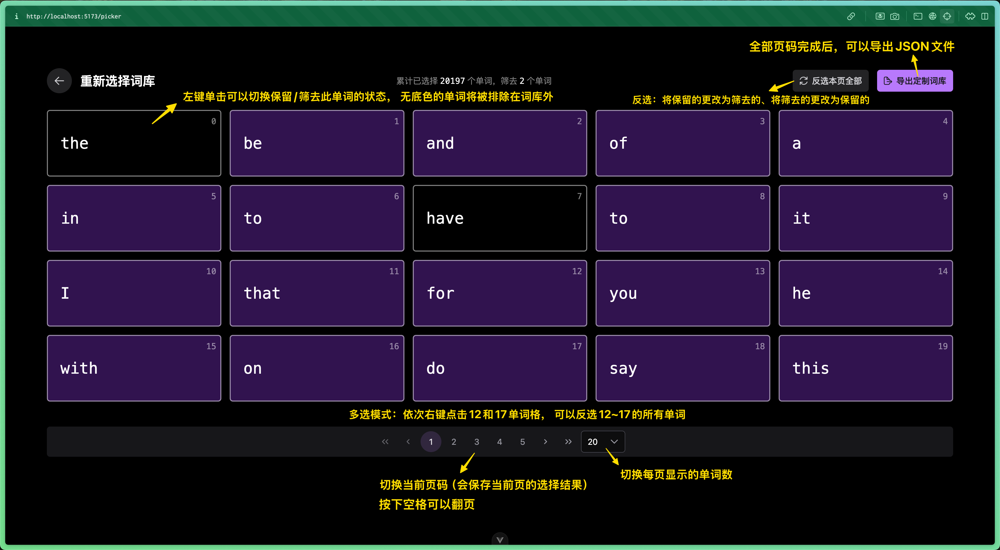

🛠 键盘背单词工具[qwerty-learner](https://github.com/RealKai42/qwerty-learner)的自定义词库定制器。

**在网页中定制你自己的词库！**

## 如何使用

本项目托管在netlify上，访问 https://qwerty-picker.netlify.app 即可开始使用。

如果无法连接可能需要代理服务，或者您可以使用源码自部署。

使用本工具得到JSON文件后，您可以访问[此处](https://github.com/RealKai42/qwerty-learner/blob/master/docs/toBuildDict.md)来导入你自己的词典。

## TODO

- [] 允许用户上传JSON文件而不是在输入框中输入，避免性能问题
- [] 在网站上补充使用教程
- [] 补充更多快捷键
- [] 实现与qwerty-learner的自动化联动